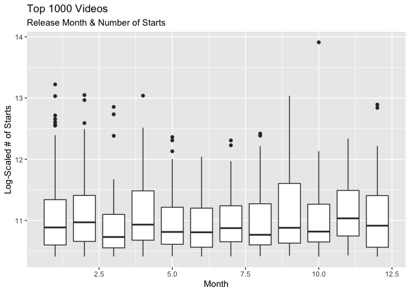
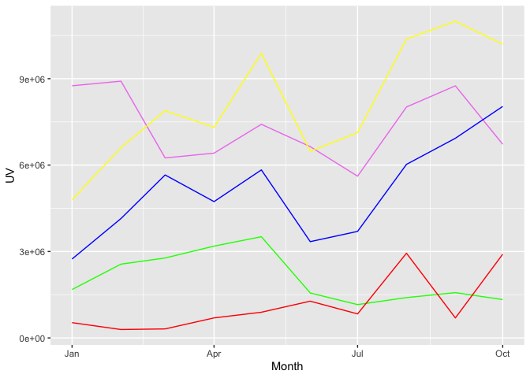
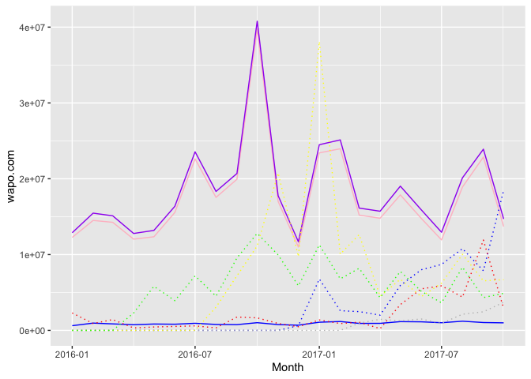
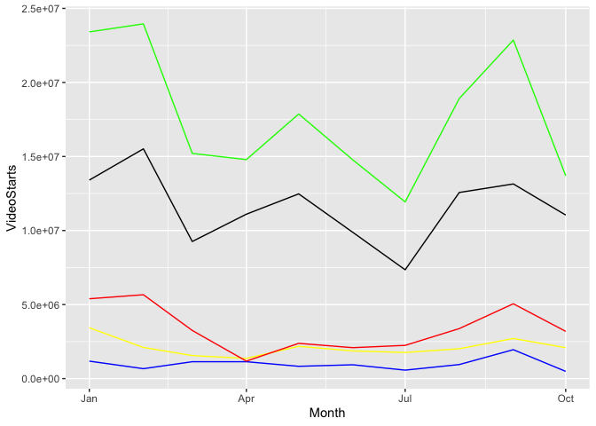

Video Starts for the Washington Post decreased from September 2016 to 2017. 
Using their data tables, I investigated why and propose some solutions


Overall, video starts decreased from September 2017 to October 2017 by 38.5%,
as shown in the graph below. WaPo App starts decreased only 3% while wapo.com decreased 40%. We can see the mean Video Starts from January 2016 to September 2017 as the red line. Video Starts fluctuates constantly, so we should not be too alarmed by the drop. But let's dig into what we're seeing and find some drivers and solutions.

## Why did Video Starts drop? How can we fix it?

**Drivers** 

1. Top two videos for the month of October were released at the end of the month.     
    + This gives less time in the month of October for videos to be started.  
    + Conversely, the top six videos in September were released in the first third of the month   
    + This is not something to fix, however, as we are at the whim of current events.  


2. Conversions from Google and Facebook referrals dropped dramatically.   
    + Google dropped from 9.9% conversion on referrals to 5.0%    
    + Facebook dropped from 7.0% to 5.5%    
    + Both platforms served less referrals from September to October    
    + Overall, conversion from Direct, Social, and Search decreased significantly   


3. Video starts from both 'Article Pages' and 'Others' spiked abnormally in September before   returning to normal in October.    
    + Video Starts are significantly impacted by starts from Article Pages and 'Others'   
    + WashingtonPost_TV is an important driver of video starts and decreased significantly from September to October   
    + Local as well is an important driver and decreased significantly, losing over 3m video starts from September to October. September 2017 was Hurricane Harvey, though, and probablythe cause of September's spike in 'Local' video starts


**Recommendations**  

1. PostTV, Politics, Lifestyle have the highest correlation to overall VideoStarts. Collaborate with the video staff to emphaszie these videos 
2. Use SEO to increase quantity and quality of Google referrals  
3. Hosting videos on MSN, AOL, other 3rd party sites might increase overall video starts, but it detracts overall traffic from the website because people don't continue browsing. Using cost analysis, determine the worth of hosting videos on 3rd party sites.

-----------------

## Appendix

**Top 1000 Videos**


```
   Month VideosReleased
1      1            150
2      2            169
3      3             93
4      4             84
5      5            101
6      6             63
7      7             40
8      8             77
9      9             84
10    10             65
11    11             33
12    12             34
```
Here we have the top 1000 videos shown by release month on the x-axis and log(starts) on the y. 
We used log(starts) to make it easier to read. 
Top videos decreases by month, which makes sense as videos released later in the year inherently are likely to have less starts because of less time remaining until EOY.
The top two videos released in October were released towards the end of the month, on the 20th and 28th respectively. 
This reduces the time people could watch, and thereby the mean starts for the month of October compared to September.
Conversely, the top six videos from September were released in the first third of the month.


**Traffic**


Every base metric shows higher traffic in October than September, 
so traffic should not be the issue.

**Video_PreRollAds**



 
 * Unique Visitors decreased 23.2%    
 * Ad Starts decreased 7.3%    
 * Ad Skipped decreased 15.4%    
 * Ad Complete increased 16.0%    
 * Starts with no pre-roll increased 318.8%    

Less unique visitors, but ad completion increased by 15.8% as well as starts w/o pre-roll.
So, video ads are not causing the problem.

**VideoStarts**


App video plays (solid blue) stays constant, wapo.com (solid pink) makes the difference
for the total (solid purple)
Also appears to follow a trend with MSN (dashed green).
This prediction matches our correlation tests.   

Variable  | Correlation w/ Total  
--------- | -------------  
wapo.com  | 0.9997233   
WaPo_Apps | 0.4236868   
Facebook  | -0.0496961   
YouTube   | 0.111523   
AppleNews | -0.084465   
AOL       | 0.3561127   
MSN       | 0.6630218   

**VideoStarts_FB_andGoogle**

Google referrals dipped dramatically. 
Also, conversions from Google referrals (green dashed line) were half as successful.
Both Google and Facebook (blue) decreased, but Google's drop was incredibly steep.

**VideoStarts_ReferrerType**

Conversions for Direct (green), Social (blue), and Search (purple) all dropped significantly.
Only OtherWebSites (yellow) stayed consistent at 9.6% for both months.

**VideoStarts_SiteArea**


Everything but VideoPages (yellow) is a statistically significant predictor of VideoStarts (green):  

 * Homepage (blue)  
 * ArticlePages (black)  
 * Others (red)  


**VideoStarts_SiteSection**


Variable         | Correlation w/ Total  
---------------- | -------------  
WP_PostTV        | 0.98179  
WP_Politics      | 0.6651529  
WP_Local         | 0.6199445  
WP_National      | 0.2657949  
WP_Opinions      | 0.4597007  
WP_Lifestyle     | 0.6343498  
WP_World         | 0.1991396  
WP_Homepage      | 0.5059815  
WP_Powerpost     | 0.1810321  
WP_Business      | 0.140148  
WP_Sports        | 0.5026746  
WP_Entertainment | 0.3061508  
Others           | -0.0515209  

